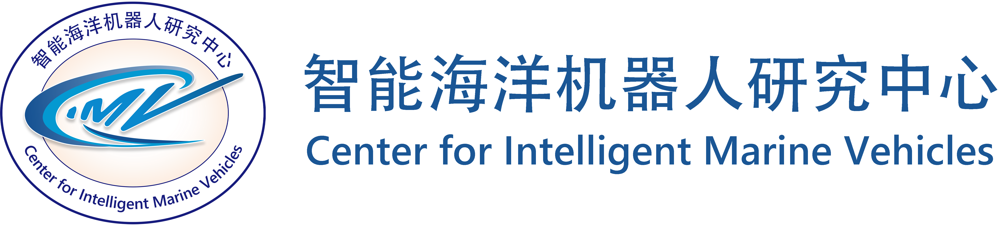
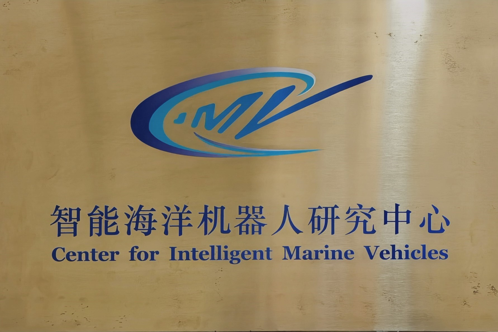

  <h1><em>Welcome to CIMV</em></h1>

  

<!-- 

  
  
  

 -->

---

### 🏫 About Us

<!--  -->

The *Center for Intelligent Marine Vehicles (CIMV)* is a premier research institution advancing embodied intelligent marine robotics. We develop theoretical foundations and practical methodologies for autonomous navigation and resilient adaptation in complex maritime environments. Our multidisciplinary team combines expertise in robotics, control systems, machine learning, marine engineering, and ocean science. We research perception, learning, planning, multi-agent coordination, and adaptive control, addressing challenges including severe sea conditions, maritime traffic, unmodeled dynamics, and system uncertainties. Our applications span autonomous vessel berthing, ocean monitoring, maritime search and rescue, port security, and shipping safety. With **300+ publications** and **10+ provincial awards**, the CIMV demonstrates research excellence through field-proven technologies enabling reliable autonomous marine operations.

---

### 🙋 Principal Investigator

- **Position:** Professor, Director of Center for Intelligent Marine Vehicles
- **Affiliation:** School of Marine Engineering, Dalian Maritime University, China
- **Research Areas:** Marine Robotics, Embodied Intelligence, Autonomous Systems
- **Editorial Positions:** 
  - Associate Editor of *IEEE Transactions on Intelligent Transportation Systems*
  - Editorial Board Member of *Ocean Engineering*
  - Associate Editor of *Journal of Field Robotics*
  - Associate Editor of *ISA Transactions*
  - Associate Editor of *IEEE Systems Journal*
  - Associate Editor of *IEEE Signal Processing Letters*
  - Associate Editor of *International Journal of Robust and Nonlinear Control*
  - Associate Editor of *International Journal of Fuzzy Systems*
  - Associate Editor of *IET Electronics Letters*
  - Associate Editor of *Journal of Marine Science and Application*
  - Editorial Board Member of *Chinese Ship Research*
- **Honors & Awards:** 
  - National Young Top-notch Talent
  - Liaoning Leading Talent
  - Liaoning Outstanding Young Scholar
  - MoT Leading Talent
  - Liaoning Provincial Science and Technology Award
  - Science and Technology Award of Chinese Navigation Society
  - Science and Technology Award of China Ocean Engineering Consulting Association
  - Clarivate Analytics Highly Cited Researcher
  - Elsevier Highly Cited Researcher
  - Elsevier World’s Top 2% Scientists
  - IEEE Senior Member, IET Fellow, IMarEST Fellow, IIAV Fellow, ISCM Fellow
- **Email:** [n.wang.dmu.cn@gmail.com](mailto:n.wang.dmu.cn@gmail.com)
- **Google Scholar:** [Google Scholar Profile](https://scholar.google.com/citations?hl=en&tzom=-480&user=dsK8i4EAAAAJ)

<!-- *Brief introduction about the director's background, achievements, and research contributions...* -->

---

### 🔬 Research Interests

- Adaptability-Critical Marine Robotics
- Marine Robot Intellligence Development
- Embodied Intelligence for Marine Robotics
- SaaS-Oriented Marine Vehicle Simulator

<!--
---

### 📚 Featured Research Projects

#### 1. Wave-Adaptive Uncrewed Quadramaran with Independent Suspension

**Status:** Active | **Language:** Matlab, Python | **Stars:** ⭐⭐⭐⭐⭐

A new wave-adaptive unmanned quadramaran (WUQ) with independent suspension mechanism is structurally designed by virtue of double-wishbone suspension (DWS) and quadruped buoyancy. 

- **Key Features**: independent suspension mechanism, wave-adaptive damping, rough-sea adaptability
- **Technologies**: double-wishbone suspension, dynamics optimization, finite element analysis, virtual prototype
- **Paper**: ["Structural Design of a Wave-Adaptive Unmanned Quadramaran With Independent Suspension"](https://ieeexplore.ieee.org/abstract/document/10478280)

#### 2. [Machine Learning Operations Platform](https://github.com/your-username/project-3)

**Status:** Maintained | **Language:** Python, Go | **Stars:** ⭐⭐⭐

MLOps platform for managing ML model lifecycle from development to production.

- **Key Features**: Model versioning, automated testing, CI/CD pipeline
- **Technologies**: TensorFlow, PyTorch, MLflow, Docker
- **Paper**: ["Operationalizing Machine Learning: A Production-Scale Approach"](http://example.com/paper3)
-->

---

### 📚 Featured Publications & Resources

#### 📊 Publication Metrics

| Category | Count | Data Source | Last Updated |
|----------|-------|-------------|--------------|
| **SCI-indexed Papers** | <!-- SCI_PAPERS_COUNT -->298<!-- /SCI_PAPERS_COUNT --> | Web of Science | <!-- LAST_UPDATE -->2026-01-04 07:36:15 UTC<!-- /LAST_UPDATE --> |
| **JCR Q1 Papers** | <!-- JCR_Q1_COUNT -->160<!-- /JCR_Q1_COUNT --> | Web of Science | <!-- LAST_UPDATE -->2026-01-04 07:36:15 UTC<!-- /LAST_UPDATE --> |
| **IEEE Transactions** | <!-- IEEE_TRANS_COUNT -->80<!-- /IEEE_TRANS_COUNT --> | Web of Science | <!-- LAST_UPDATE -->2026-01-04 07:36:15 UTC<!-- /LAST_UPDATE --> |
| **Total Publications** | <!-- TOTAL_PUBLICATIONS -->355<!-- /TOTAL_PUBLICATIONS --> | Google Scholar | <!-- LAST_UPDATE -->2026-01-04 07:36:15 UTC<!-- /LAST_UPDATE --> |
| **Total Citations** | <!-- TOTAL_CITATIONS -->13668<!-- /TOTAL_CITATIONS --> | Google Scholar | <!-- LAST_UPDATE -->2026-01-04 07:36:15 UTC<!-- /LAST_UPDATE --> |
| **H-index** | <!-- H_INDEX -->68<!-- /H_INDEX --> | Google Scholar | <!-- LAST_UPDATE -->2026-01-04 07:36:15 UTC<!-- /LAST_UPDATE --> |

*Note: Metrics are automatically updated from external databases. Last update: <!-- LAST_UPDATE -->2026-01-04 07:36:15 UTC<!-- /LAST_UPDATE -->*

#### 📜 Selected Publications

<strong>🌏International Journal Papers</strong>

1. Ning Wang, Yuan Feng, Lixin Tian, Yi Wei, "RSOS-Net: Real-time surface obstacle segmentation network for uncrewed waterborne vehicles," *IEEE Transactions on Intelligent Transportation Systems*, vol. 27, no. 1, pp. 1052-1065, Jan. 2026. [Link](https://ieeexplore.ieee.org/document/11267114)

1. Jianchuan Yin , Guokang Xu , Ning Wang , Nini Wang , Zeguo Zhang, "A survey of small sea-surface target detection for maritime search and rescue," *IEEE Transactions on Intelligent Transportation Systems*, vol. 27, no. 1, pp. 211-231, Jan. 2026. [Link](https://ieeexplore.ieee.org/document/11295973)

1. Yongchun Ma, Yongpeng Weng, Ning Wang, "Finite-time sideslip observer-based model-free fast path-following control of disturbed autonomous surface vehicles with large time-varying sideslip," *Ocean Engineering*, vol. 344, p. 123600, Jan. 2026. [Link](https://www.sciencedirect.com/science/article/abs/pii/S0029801825032822)

1. Yazhi Zhao, Ning Wang, Zhengkai Lv, "Review on hybrid power system modeling and optimization of hydrogen-electric ships," *Ocean Engineering*, vol. 343, p. 123456, Jan. 2026. [Link](https://www.sciencedirect.com/science/article/abs/pii/S0029801825031385)

1. Ning Wang, Haiyan Zhao, Tingkai Chen, "DR-LIOM: Direct registration LiDAR-inertial odometry and mapping for uncrewed surface vehicles in a harbor," *IEEE Transactions on Intelligent Transportation Systems*, vol. 26, no. 11, pp. 19197-19213, Nov. 2025. [Link](https://ieeexplore.ieee.org/abstract/document/11146480)

1. Yuji Zeng, Qinjin Zhang, Herbert Ho Ching Iu, Xiaoyan Chen, Yancheng Liu, Haohao Guo, Xinan Zhang, Ning Wang, Siyuan Liu, "Integrated power management strategy for multisource hybrid power systems in fuel cell vessels: Focusing on dynamic lifetime extension and optimal hydrogen consumption," *IEEE Transactions on Power Electronics*, vol. 40, no. 6, pp. 8792-8811, Jun. 2025. [Link](https://ieeexplore.ieee.org/document/10884947)

1. Qiuxia Zhang, Yongpeng Weng, Ning Wang, "Data-driven coordinated path-following of multiple marine surface vehicles with input saturations," *ISA Transactions*, vol. 167, pp. 134-143, Dec. 2025. [Link](https://www.sciencedirect.com/science/article/abs/pii/S0019057825004094)

1. Qinjin Zhang, Liming Song, Yji Zeng, Yancheng Liu, Siyuan Liu, Ning Wang, "Real-time power optimization strategy for fuel cell ships based on improved genetic simulated annealing algorithm," *Electric Power Systems Research*, vol. 245, p. 111647, Aug. 2025. [Link](https://www.sciencedirect.com/science/article/abs/pii/S0378779625002391)

1. Ning Wang, Yuli Hou, Chidong Qiu, Zaijin You, "Underactuated navigation actor-critic deep reinforcement learning framework for holistic path planning of uncrewed surface vehicles," *IEEE Transactions on Intelligent Transportation Systems*, vol. 26, no. 11, pp. 21245-21256, Nov. 2025. [Link](https://ieeexplore.ieee.org/document/11087740)

1. Chaojiang Liang, Zhihua Guo, Ben Niu, Ning Wang, Ying Zhao, Zhiguang Feng, "Sensor attacks detection and reconstruction for AUVs: An improved zonotopic analysis approach," *IEEE Internet of Things Journal*, vol. 12, no. 19, pp. 40620-40627, Oct. 2025. [Link](https://ieeexplore.ieee.org/abstract/document/11082319)

1. Heda Xu, Xiaojia Xiang, Chao Yan, Zixing Li, Han Zhou, Ning Wang, "Grey wolf optimization enhanced collaborative path planning for UUV swarms," *Ocean Engineering*, vol. 329, p. 121082, Jun. 2025. [Link](https://www.sciencedirect.com/science/article/abs/pii/S0029801825007954)

1. Yongpeng Weng, Min Tian, Ning Wang, "Finite-time model-free adaptive control for MIMO nonlinear systems with adjustable fast convergence domain: Theory and experiment," *IEEE Transactions on Industrial Electronics*, vol. 72, no. 10, pp. 10542-10552, Oct. 2025. [Link](https://ieeexplore.ieee.org/abstract/document/10925368)

1. Qiuxia Zhang, Yongpeng Weng, Ning Wang, "Data‐driven cooperative LOS guidance‐based constrained path‐following of multiple unmanned surface vehicles," *International Journal of Robust and Nonlinear Control*, vol. 36, no. 1, pp. 360-373, Jan. 2026. [Link](https://onlinelibrary.wiley.com/doi/abs/10.1002/rnc.70136)

1. Ning Wang, Wei Jia, Haojun Wu, Yueying Wang, "Event-triggered self-organizing swarm control of distributed unmanned surface vehicles," *IEEE Transactions on Intelligent Transportation Systems*, vol. 26, no. 3, pp. 3431-3445, Mar. 2025. [Link](https://ieeexplore.ieee.org/abstract/document/10819005)

1. Ning Wang, Yanzheng Chen, Yi Wei, Tingkai Chen, Hamid Reza Karimi, "UP‐GAN: Channel‐spatial attention‐based progressive generative adversarial network for underwater image enhancement," *Journal of Field Robotics*, vol. 41, no. 8, pp. 2597-2614, Dec. 2024. [Link](https://onlinelibrary.wiley.com/doi/abs/10.1002/rob.22378)

1. Ning Wang, Jialin Song, "Lightweight optimization on suspension mechanism of a wave-adaptive unmanned quadramaran," *Ocean Engineering*, vol. 310, p. 118545, Oct. 2024. [Link](https://www.sciencedirect.com/science/article/abs/pii/S0029801824018833)

1. Xiang Liu, Huaicheng Yan, Weixiang Zhou, Ning Wang, Yueying Wang, "Event-triggered optimal tracking control for underactuated surface vessels via neural reinforcement learning," *IEEE Transactions on Industrial Informatics*, vol. 20, no. 11, pp. 12837-12847, Nov. 2024. [Link](https://ieeexplore.ieee.org/abstract/document/10604933)

1. Ning Wang, Yuanyuan Wang, Yuan Feng, Yi Wei, "AodeMar: Attention-aware occlusion detection of vessels for maritime autonomous surface ships," *IEEE Transactions on Intelligent Transportation Systems*, vol. 25, no. 10, pp. 13584-13597, Oct. 2024. [Link](https://ieeexplore.ieee.org/abstract/document/10537110)

1. Ning Wang, Yuanyuan Wang, Yuan Feng, Yi Wei, "MDD-ShipNet: Math-data integrated defogging for fog-occlusion ship detection," *IEEE Transactions on Intelligent Transportation Systems*, vol. 25, no. 10, pp. 15040-15052, Oct. 2024. [Link](https://ieeexplore.ieee.org/abstract/document/10527397)

1. Chunlai Yu, Junkang Zhu, Yuanting Hu, Hao Zhu, Ning Wang, Haohao Guo, Qinjin Zhang, Siyuan Liu, "Prescribed-time observer-based sideslip compensation in USV line-of-sight guidance," *Ocean Engineering*, vol. 298, p. 117177, Apr. 2024. [Link](https://www.sciencedirect.com/science/article/abs/pii/S0029801824005146)

1. Tingkai Chen, Ning Wang, "Shuffled grouping cross-channel attention-based bilateral-filter-interpolation deformable convnet with applications to benthonic organism detection," *IEEE Transactions on Artificial Intelligence*, vol. 5, no. 9, pp. 4506-4518, Oct. 2024. [Link](https://ieeexplore.ieee.org/abstract/document/10494116)

1. Hongkun He, Ning Wang, Dazhi Huang, Bing Han, "Active vision-based finite-time trajectory-tracking control of an unmanned surface vehicle without direct position measurements," *IEEE Transactions on Intelligent Transportation Systems*, vol. 25, no. 9, pp. 12151-12162, Sep. 2024. [Link](https://ieeexplore.ieee.org/abstract/document/10443713)

1. Ning Wang, Hongkun He, Yuli Hou, Bin Han, "Model-free visual servo swarming of manned-unmanned surface vehicles with visibility maintenance and collision avoidance," *IEEE Transactions on Intelligent Transportation Systems*, vol. 25, no. 1, pp. 697-709, Jan. 2024. [Link](https://ieeexplore.ieee.org/abstract/document/10247104) 

1. Ning Wang, Yuanyuan Wang, Yi Wei, Bing Han, Yuan Feng, "Marine vessel detection dataset and benchmark for unmanned surface vehicles," *Applied Ocean Research*, vol. 142, p. 103835, Jan. 2024. [Link](https://www.sciencedirect.com/science/article/abs/pii/S0141118723003760)

1. Pengli Zhu, Yancheng Liu, Minyi Xu, Xianping Fu, Ning Wang, Siyuan Liu, "Unsupervised multiple representation disentanglement framework for improved underwater visual perception," *Journal of Oceanic Engineering*, vol. 49, no. 1, pp. 48-65, Jan. 2024. [Link](https://www.sciencedirect.com/science/article/abs/pii/S0029801823022746)

1. Ning Wang, Yongjin Liu, Jiaolong Liu, Wei Jia, Chengxiang Zhang, "Reinforcement learning swarm of self-organizing unmanned surface vehicles with unavailable dynamics," *Ocean Engineering*, vol. 289, p. 116313, Dec. 2023. [Link](https://www.sciencedirect.com/science/article/abs/pii/S0029801823026975)

1. Ning Wang, Huihui Wu, Yuhang Zhang, Jialin Song, Yejin Lin, Lizhu Hao, "Self-organizing data-driven prediction model of ship maneuvering fast-dynamics," *Ocean Engineering*, vol. 288, p. 115989, Nov. 2023. [Link](https://www.sciencedirect.com/science/article/abs/pii/S0029801823023739)

1. Ning Wang, Xiangjun Kong, Boyu Ren, Lizhu Hao, Bing Han, "SeaBil: Self-attention-weighted ultrashort-term deep learning prediction of ship maneuvering motion," *Ocean Engineering*, vol. 287, p. 115890, Nov. 2023. [Link](https://www.sciencedirect.com/science/article/abs/pii/S0029801823022746)

1. Qi Dong, Ning Wang, Jialin Song, Lizhu Hao, Shaoman Liu, Bing Han, Kai Qu, "Math-data integrated prediction model for ship maneuvering motion," *Ocean Engineering*, vol. 285, p. 115255, Oct. 2023. [Link](https://www.sciencedirect.com/science/article/abs/pii/S0029801823016396)

1. Tingkai Chen, Ning Wang, Yanzheng Chen, Xiangjun Kong, Yejin Lin, Hong Zhao, Hamid Reza Karimi, "Semantic attention and relative scene depth-guided network for underwater image enhancement," *Engineering Applications of Artificial Intelligence*, vol. 123, p. 106532, Aug. 2023. [Link](https://www.sciencedirect.com/science/article/abs/pii/S0952197623007169)

1. Kangjian Shao, Ning Wang, Hongde Qin, "Sideslip angle observation-based LOS and adaptive finite-time path following control for sailboat," *Ocean Engineering*, vol. 281, p. 114636, Aug. 2023. [Link](https://www.sciencedirect.com/science/article/abs/pii/S002980182301020X)

1. Ning Wang, Tingkai Chen, Shaoman Liu, Rongfeng Wang, Hamid Reza Karimi, Yejin Lin, "Deep learning-based visual detection of marine organisms: A survey," *Neurocomputing*, vol. 532, pp. 1-32, May 2023. [Link](https://www.sciencedirect.com/science/article/abs/pii/S092523122300156X)

1. Ning Wang, Tingkai Chen, Xiangjin Kong, Yanzheng Chen, Rongfeng Wang, Yongjun Gong, Shiji Song, "Underwater attentional generative adversarial networks for image enhancement," *IEEE Transactions on Human-Machine Systems*, vol. 53, no. 3, pp. 490-500, Jul. 2023. [Link](https://ieeexplore.ieee.org/abstract/document/10102682/) 

1. Shengke Ni, Ning Wang, Ziyi Qin, Xihan Yang, Zhengjiang Liu, Haijiang Li, "A distributed coordinated path planning algorithm for maritime autonomous surface ship," *Ocean Engineering*, vol. 271, p. 113759, Mar. 2023. [Link](https://www.sciencedirect.com/science/article/abs/pii/S0029801823001439)

1. Hongde Qin, Jinshuai Si, Ning Wang, Liyang Gao, "Fast fixed-time nonsingular terminal sliding-mode formation control for autonomous underwater vehicles based on a disturbance observer," *Ocean Engineering*, vol. 270, p. 113423, Feb. 2023. [Link](https://www.sciencedirect.com/science/article/abs/pii/S0029801822027068)

1. Ning Wang, Yuhang Zhang, Choon Ki Ahn, Qingyang Xu, "Autonomous pilot of unmanned surface vehicles: Bridging path planning and tracking," *IEEE Transactions on Vehicular Technology*, vol. 71, no. 3, pp. 2358-2374, May 2022. **(Highly Cited Paper)** [Link](https://ieeexplore.ieee.org/abstract/document/9656611) 

1. Shengke Ni, Ning Wang, Wei Li, Zhengjiang Liu, Shaoman Liu, Siming Fang, Teng Zhang, "A deterministic collision avoidance decision-making system for multi-MASS encounter situation," *Ocean Engineering*, vol. 266, p. 113087, Dec. 2022. [Link](https://www.sciencedirect.com/science/article/abs/pii/S0029801822023708)

1. Yejin Lin, Ning Wang, Xin Hui, Hamid Reza Karimi, Shaoman Liu, "Finite-time cascade-like tracking control of direct-drive wave energy converters," *Ocean Engineering*, vol. 266, p. 112622, Dec. 2022. [Link](https://www.sciencedirect.com/science/article/abs/pii/S0029801822019059)

1. Yongpeng Weng, Ning Wang, "SMC-based model-free tracking control of unknown autonomous surface vehicles," *ISA transactions*, vol. 130, pp. 684-691, Nov. 2022. [Link](https://www.sciencedirect.com/science/article/abs/pii/S0019057822004165)

1. Yongpeng Weng, Ning Wang, "Finite-time observer-based model-free time-varying sliding-mode control of disturbed surface vessels," *Ocean Engineering*, vol. 251, p. 110866, May 2022. [Link](https://www.sciencedirect.com/science/article/abs/pii/S0029801822003067)

1. Ning Wang, Ying Gao, Chen Yang, Xuefeng Zhang, "Reinforcement learning-based finite-time tracking control of an unknown unmanned surface vehicle with input constraints," *Neurocomputing*, vol. 484, pp. 26-37, May 2022. [Link](https://www.sciencedirect.com/science/article/abs/pii/S0925231221015733)

1. Ning Wang, He Li, "Leader-follower formation control of surface vehicles: A fixed-time control approach," *ISA Transactions*, vol. 124, pp. 356-364, Apr. 2022. **(Highly Cited Paper)** [Link](https://www.sciencedirect.com/science/article/abs/pii/S0019057820302305)

1. Hamid Reza Karimi, Ning Wang, Zhihong Man, "Learning‐based robust control methodologies under information constraints,", *International Journal of Robust & Nonlinear Control*, vol. 32, no. 5, pp. 2467-2471, Mar. 2022. [Link](https://onlinelibrary.wiley.com/doi/full/10.1002/rnc.5973)

1. Ning Wang, Ying Gao, Yongjin Liu, Kun Li, "Self‐learning‐based optimal tracking control of an unmanned surface vehicle with pose and velocity constraints," *International Journal of Robust & Nonlinear Control*, vol. 32, no. 5, pp. 2950-2968, Mar. 2022. [Link](https://onlinelibrary.wiley.com/doi/abs/10.1002/rnc.5978)

1. Ning Wang, Yuanyuan Wang, Meng Joo Er, "Review on deep learning techniques for marine object recognition: Architectures and algorithms," *Control Engineering Practice*, vol. 118, p. 104458, Jan. 2022. **(Highly Cited Paper)** [Link](https://www.sciencedirect.com/science/article/abs/pii/S0967066120300964)

1. Ning Wang, Shun-Feng Su, "Finite-time unknown observer based interactive trajectory tracking control of asymmetric underactuated surface vehicles," *IEEE Transactions on Control Systems Technology*, vol. 29, no. 2, pp. 794-803, Mar. 2021. **(Highly Cited Paper)** [Link](https://ieeexplore.ieee.org/abstract/document/8933358)

1. Ning Wang, Hongkun He, "Extreme learning-based monocular visual servo of an unmanned surface vessel," *IEEE Transactions on Industrial Informatics*, vol. 17, no. 8, pp. 5152-5163, Aug. 2021. [Link](https://ieeexplore.ieee.org/abstract/document/9240068)

1. Tingkai Chen, Ning Wang, Rongfeng Wang, Hong Zhao, Guichen Zhang, "One-stage CNN detector-based benthonic organisms detection with limited training dataset," *Neural Networks*, vol. 144, pp. 247-259, Dec. 2021. [Link](https://www.sciencedirect.com/science/article/abs/pii/S0893608021003191)

1. Ning Wang, Zhongben Zhu, Hongde Qin, Zhongchao Deng, Yanchao Sun, "Finite‐time extended state observer‐based exact tracking control of an unmanned surface vehicle," *International Journal of Robust & Nonlinear Control*, vol. 31, no. 5, pp. 1704-1719, Mar. 2021. [Link](https://onlinelibrary.wiley.com/doi/abs/10.1002/rnc.5369)

1. Ning Wang, Ying Gao, Xuefeng Zhang, "Data-driven performance-prescribed reinforcement learning control of an unmanned surface vehicle," *IEEE Transactions on Neural Networks and Learning Systems*, vol. 32, no. 12, pp. 5456-5467, Dec. 2021. **(Highly Cited Paper)** [Link](https://ieeexplore.ieee.org/abstract/document/9358986)

1. Ning Wang, Choon Ki Ahn, "Coordinated trajectory tracking control of a marine aerial-surface heterogeneous system," *IEEE/ASME Transactions on Mechatronics*, vol. 26, no. 6, pp. 3198-3210, Dec. 2021. [Link](https://ieeexplore.ieee.org/abstract/document/9339888)

1. Ning Wang, Ying Gao, Hong Zhao, Choon Ki Ahn, "Reinforcement learning-based optimal tracking control of an unknown unmanned surface vehicle," *IEEE Transactions on Neural Networks and Learning Systems*, vol. 32, no. 7, pp. 3034-3045, Jul. 2021. **(Highly Cited Paper)** [Link](https://ieeexplore.ieee.org/abstract/document/9154585)

1. Wei Sun, Jhih-Wei Lin, Shun-Feng Su, Ning Wang, Meng Joo Er, "Reduced adaptive fuzzy decoupling control for lower limb exoskeleton," *IEEE Transactions on Cybernetics*, vol. 51, no. 3, pp. 1099-1109, Mar. 2021. [Link](https://ieeexplore.ieee.org/abstract/document/9013052)

1. Ning Wang, Hongwei Xu, "Dynamics-constrained global-local hybrid path planning of an autonomous surface vehicle," *IEEE Transactions on Vehicular Technology*, vol. 69, no. 7, pp. 6928-6942, Jul. 2020. [Link](https://ieeexplore.ieee.org/abstract/document/9082129)

1. Ning Wang, Xinxiang Pan, Shun-Feng Su, "Finite-time fault-tolerant trajectory tracking control of an autonomous surface vehicle," *Journal of the Franklin Institute*, vol. 357, no. 16 pp. 11114-11135, Nov. 2020. [Link](https://www.sciencedirect.com/science/article/abs/pii/S0016003219303461)

1. Yongpeng Weng, Ning Wang, "Data‐driven robust backstepping control of unmanned surface vehicles," *International Journal of Robust & Nonlinear Control*, vol. 30, no. 9, pp. 3624-3638, Jun. 2020. [Link](https://onlinelibrary.wiley.com/doi/abs/10.1002/rnc.4956)

1. Hongde Qin, Chengpeng Li, Yanchao Sun, Ning Wang, "Adaptive trajectory tracking algorithm of unmanned surface vessel based on anti-windup compensator with full-state constraints," *Ocean Engineering*, vol. 200, p. 106906, Mar. 2020. [Link](https://www.sciencedirect.com/science/article/abs/pii/S0029801819309916)

1. Yongpeng Weng, Ning Wang, Carlos Guedes Soares, "Data-driven sideslip observer-based adaptive sliding-mode path-following control of underactuated marine vessels," *Ocean Engineering*, vol. 197, p. 106910, Feb. 2020. [Link](https://www.sciencedirect.com/science/article/abs/pii/S0029801819309953)

1. Ning Wang, Hongkun He, "Dynamics-level finite-time fuzzy monocular visual servo of an unmanned surface vehicle," *IEEE Transactions on Industrial Electronics*, vol. 67, no. 11, pp. 9648-9658, Nov. 2020. **(Highly Cited Paper)** [Link](https://ieeexplore.ieee.org/abstract/document/8902216)

1. Ning Wang, Zhongchao Deng, "Finite-time fault estimator based fault-tolerance control for a surface vehicle with input saturations," *IEEE Transactions on Industrial Informatics*, vol. 16, no. 2, pp. 1172-1181, Feb. 2020. **(Highly Cited Paper)** [Link](https://ieeexplore.ieee.org/abstract/document/8769923)

1. Ning Wang, Hamid Reza Karimi, "Successive waypoints tracking of an underactuated surface vehicle," *IEEE Transactions on Industrial Informatics*, vol. 16, no. 2, pp. 898-908, Feb. 2020. **(Highly Cited Paper)** [Link](https://ieeexplore.ieee.org/abstract/document/8736351)

1. Ning Wang, Choon Ki Ahn, "Hyperbolic-tangent LOS guidance-based finite-time path following of underactuated marine vehicles," *IEEE Transactions on Industrial Electronics*, vol. 67, no. 10, pp. 8566-8575, Oct. 2020. [Link](https://ieeexplore.ieee.org/abstract/document/8879681)

1. Chao Deng, Meng Joo Er, Guang-Hong Yang, Ning Wang, "Event-triggered consensus of linear multiagent systems with time-varying communication delays," *IEEE Transactions on Cybernetics*, vol. 50, no. 7, pp. 2916-2925, Jul. 2020. [Link](https://ieeexplore.ieee.org/abstract/document/8794709)

1. Ning Wang, Hamid Reza Karimi, Hongyi Li, Shun-Feng Su, "Accurate trajectory tracking of disturbed surface vehicles: A finite-time control approach," *IEEE/ASME Transactions on Mechatronics*, vol. 24, no. 3, pp. 1064-1074, Jun. 2019. **(Highly Cited Paper)** [Link](https://ieeexplore.ieee.org/abstract/document/8671737)

1. Guangjie Han, Yu He, Jinfang Jiang, Ning Wang, Mohsen Guizani, James Adu Ansere, "A synergetic trust model based on SVM in underwater acoustic sensor networks," *IEEE Transactions on Vehicular Technology*, vol. 68, no. 11, pp. 11239-11247, Nov. 2019. [Link](https://ieeexplore.ieee.org/abstract/document/8823047)

1. Ning Wang, Xinxiang Pan, "Path-following of autonomous underactuated ships: A translation-rotation cascade control approach," *IEEE/ASME Transactions on Mechatronics*, vol. 24, no. 6, pp. 2583-2593, Dec. 2019. [Link](https://ieeexplore.ieee.org/abstract/document/8782637)

1. Ning Wang, Xiaozhao Jin, Meng Joo Er, "A multilayer path planner for a USV under complex marine environments," *Ocean Engineering*, vol. 184, pp. 1-10, Jul. 2019. [Link](https://www.sciencedirect.com/science/article/abs/pii/S0029801819302422)

1. Ning Wang, Zhuo Sun, Yuhang Jiao, Guangjie Han, "Surge-heading guidance based finite-time path-following of underactuated marine vehicles," *IEEE Transactions on Vehicular Technology*, vol. 68, no. 9, pp. 8523-8532, Sep. 2019. [Link](https://ieeexplore.ieee.org/abstract/document/8758933)

1. Ning Wang, Qi Deng, Guangming Xie, Xinxiang Pan, "Hybrid finite-time trajectory tracking control of a quadrotor," *ISA Transactions*, vol. 90, pp. 278-286, Jul. 2019. [Link](https://www.sciencedirect.com/science/article/abs/pii/S001905781830538X)

1. Siyuan Liu, Yancheng Liu, Xiaoling Liang, Ning Wang, "Uncertainty observation-based adaptive succinct fuzzy-neuro dynamic surface control for trajectory tracking of fully actuated underwater vehicle system with input saturation," *Nonlinear Dynamics*, vol. 98, no. 3, pp. 1683-1699, Nov. 2019. [Link](https://link.springer.com/article/10.1007/s11071-019-05279-w)

1. Ning Wang, Zhuo Sun, Jianchuan Yin, Zaojian Zou, Shun-Feng Su, "Fuzzy unknown observer-based robust adaptive path following control of underactuated surface vehicles subject to multiple unknowns," *Ocean Engineering*, vol. 176, pp. 57-64, Mar. 2019. **(Highly Cited Paper)** [Link](https://www.sciencedirect.com/science/article/abs/pii/S0029801818308357)

1. Ning Wang, Guangming Xie, Xinxiang Pan, Shun-Feng Su, "Full-state regulation control of asymmetric underactuated surface vehicles," *IEEE Transactions on Industrial Electronics*, vol. 66, no. 11, pp. 8741-8750, Nov. 2019. **(Highly Cited Paper)** [Link](https://ieeexplore.ieee.org/abstract/document/8605518)

1. Ning Wang, Shun-Feng Su, Xinxiang Pan, Xiang Yu, Guangming Xie, "Yaw-guided trajectory tracking control of an asymmetric underactuated surface vehicle," *IEEE Transactions on Industrial Informatics*, vol. 15, no. 6, pp. 3502-3513, Jun. 2019. **(Highly Cited Paper)** [Link](https://ieeexplore.ieee.org/abstract/document/8500342)

1. Ning Wang, Shun-Feng Su, Min Han, Wen-Hua Chen, "Backpropagating constraints based trajectory tracking control of a quadrotor with constrained actuator dynamics and complex unknowns," *IEEE Transactions on Systems, Man, and Cybernetics: Systems*, vol. 49, no. 7, pp. 1322-1337, Jul. 2019. **(Highly Cited Paper)** [Link](https://ieeexplore.ieee.org/abstract/document/8481409)

1. Liang Cao, Hongyi Li, Ning Wang, Qi Zhou, "Observer-based event-triggered adaptive decentralized fuzzy control for nonlinear large-scale systems", *IEEE Transactions on Fuzzy Systems*, vol. 27, no. 6, pp. 1201-1214, Jun. 2019. **(Highly Cited Paper)** [Link](https://ieeexplore.ieee.org/abstract/document/8481409)

1. Min Han, Shuhui Zhang, Meiling Xu, Tie Qiu, Ning Wang, "Multivariate chaotic time series online prediction based on improved kernel recursive least squares algorithm," *IEEE Transactions on Cybernetics*, vol. 49, no. 4, pp. 1160-1172, Apr. 2019. [Link](https://ieeexplore.ieee.org/abstract/document/8291833)

1. Ning Wang, Jing-Chao Sun, Min Han, Zhongjiu Zheng, Meng Joo Er, "Adaptive approximation-based regulation control for a class of uncertain nonlinear systems without feedback linearizability," *IEEE Transactions on Neural Networks and Learning Systems*, vol. 29, no. 8, pp. 3747-3760, Aug. 2018. **(Highly Cited Paper)** [Link](https://ieeexplore.ieee.org/abstract/document/8026570)

1. Ning Wang, Shun-Feng Su, Jianchuan Yin, Zhongjiu Zheng, Meng Joo Er, "Global asymptotic model-free trajectory-independent tracking control of an uncertain marine vehicle: An adaptive universe-based fuzzy control approach," *IEEE Transactions on Fuzzy Systems*, vol. 26, no. 3, pp. 1613-1625, Jun. 2018. **(Highly Cited Paper)** [Link](https://ieeexplore.ieee.org/abstract/document/8003434)

1. Ning Wang, Jing-Chao Sun, Meng Joo Er, "Tracking-error-based universal adaptive fuzzy control for output tracking of nonlinear systems with completely unknown dynamics," *IEEE Transactions on Fuzzy Systems*, vol. 26, no. 2, pp. 869-883, Apr. 2018. **(Highly Cited Paper)** [Link](https://ieeexplore.ieee.org/abstract/document/7908943)

1. Jianchuan Yin, Ning Wang, Anastassios N Perakis, "A real-time sequential ship roll prediction scheme based on adaptive sliding data window," *IEEE Transactions on Systems, Man, and Cybernetics: Systems*, vol. 48, no. 12, pp. 2115-2125, Dec. 2018. [Link](https://ieeexplore.ieee.org/abstract/document/8010345)

1. Jian-Chuan Yin, Anastassios N Perakis, Ning Wang, "A real-time ship roll motion prediction using wavelet transform and variable RBF network," *Ocean Engineering*, vol. 160, pp. 10-19, Jul. 2018. [Link](https://www.sciencedirect.com/science/article/abs/pii/S0029801818305523)

1. Jian-Chuan Yin, Anastassios N Perakis, Ning Wang, "An ensemble real-time tidal level prediction mechanism using multiresolution wavelet decomposition method", *IEEE Transactions on Geoscience and Remote Sensing*, vol. 56, no. 8, pp. 4856-4865, Aug. 2018. [Link](https://ieeexplore.ieee.org/abstract/document/8392510)

1. Ning Wang, Chunjiang Qian, Zong-Yao Sun, "Global asymptotic output tracking of nonlinear second-order systems with power integrators," *Automatica*, vol. 80, pp. 156-161, Jun. 2017. **(Highly Cited Paper)** [Link](https://www.sciencedirect.com/science/article/abs/pii/S0005109817301000)

1. Ning Wang, Shuailin Lv, Weidong Zhang, Zhongzhong Liu, Meng Joo Er, "Finite-time observer based accurate tracking control of a marine vehicle with complex unknowns," *Ocean Engineering*, vol. 145, pp. 406-415, Nov. 2017. **(Highly Cited Paper)** [Link](https://www.sciencedirect.com/science/article/abs/pii/S0029801817305814)

1. Ning Wang, Shuailin Lv, Meng Joo Er, Wen-Hua Chen, "Fast and accurate trajectory tracking control of an autonomous surface vehicle with unmodeled dynamics and disturbances," *IEEE Transactions on Intelligent Vehicles*, vol. 1, no. 3, pp. 230-243, Sep. 2016. **(Highly Cited Paper)** [Link](https://ieeexplore.ieee.org/abstract/document/7829290)

1. Ning Wang, Meng Joo Er, "Direct adaptive fuzzy tracking control of marine vehicles with fully unknown parametric dynamics and uncertainties," *IEEE Transactions on Control Systems Technology*, vol. 24, no. 5, pp. 1845-1852, Sep. 2016. **(Highly Cited Paper)** [Link](https://ieeexplore.ieee.org/abstract/document/7374698)

1. Ning Wang, Chunjiang Qian, Jing-Chao Sun, Yan-Cheng Liu, "Adaptive robust finite-time trajectory tracking control of fully actuated marine surface vehicles," *IEEE Transactions on Control Systems Technology*, vol. 24, no. 4, pp. 1454-1462, Jul. 2016. **(Highly Cited Paper)** [Link](https://ieeexplore.ieee.org/abstract/document/7331625)

1. Zhifei Shao, Meng Joo Er, Ning Wang, "An efficient leave-one-out cross-validation-based extreme learning machine (ELOO-ELM) with minimal user intervention," *IEEE Transactions on Cybernetics*, vol. 46, no. 8, pp. 1939-1951, Aug. 2016. [Link](https://ieeexplore.ieee.org/abstract/document/7173036)
 
1. Ning Wang, Meng Joo Er, Jing-Chao Sun, Yan-Cheng Liu, "Adaptive robust online constructive fuzzy control of a complex surface vehicle system," *IEEE Transactions on Cybernetics*, vol. 46, no. 7, pp. 1511-1523, Jul. 2016. **(Highly Cited Paper)** [Link](https://ieeexplore.ieee.org/abstract/document/7166312)

1. Ning Wang, Meng Joo Er, "Self-constructing adaptive robust fuzzy neural tracking control of surface vehicles with uncertainties and unknown disturbances," *IEEE Transactions on Control Systems Technology*, vol. 23, no. 3, pp. 991-1002, May 2016. **(Highly Cited Paper)** [Link](https://ieeexplore.ieee.org/abstract/document/6919299)

1. Ning Wang, Jing-Chao Sun, Meng Joo Er, Yan-Cheng Liu, "A novel extreme learning control framework of unmanned surface vehicles," *IEEE Transactions on Cybernetics*, vol. 46, no. 5, pp. 1106-1117, May 2016. **(Highly Cited Paper)** [Link](https://ieeexplore.ieee.org/abstract/document/7098387)

1. Ning Wang, Meng Joo Er, Min Han, "Generalized single-hidden layer feedforward networks for regression problems," *IEEE Transactions on Neural Networks and Learning Systems*, vol. 26, no. 6, pp. 1161-1176, Jun. 2015. **(Highly Cited Paper)** [Link](https://ieeexplore.ieee.org/abstract/document/6856201)

1. Ning Wang, Meng Joo Er, Min Han, "Large tanker motion model identification using generalized ellipsoidal basis function-based fuzzy neural networks," *IEEE Transactions on Cybernetics*, vol. 45, no. 12, pp. 2732-2743, Dec. 2015. **(Highly Cited Paper)** [Link](https://ieeexplore.ieee.org/abstract/document/7001036)

1. Ning Wang, Meng Joo Er, Min Han, "Dynamic tanker steering control using generalized-ellipsoidal-basis-function-based fuzzy neural networks," *IEEE Transactions on Fuzzy Systems*, vol. 23, no. 5, pp. 1414-1427, Oct. 2015. **(Highly Cited Paper)** [Link](https://ieeexplore.ieee.org/abstract/document/6918478)

1. Ning Wang, Meng Joo Er, Min Han, "Parsimonious extreme learning machine using recursive orthogonal least squares," *IEEE Transactions on Neural Networks and Learning Systems*, vol. 25, no. 10, pp. 1828-1841, Oct. 2014. **(Highly Cited Paper)** [Link](https://ieeexplore.ieee.org/abstract/document/6704311)

1. Ning Wang, "A novel analytical framework for dynamic quaternion ship domains," *Journal of Navigation*, vol. 66, no. 2, pp. 265-281, Mar. 2013. **(Highly Cited Paper)** [Link](https://www.cambridge.org/core/journals/journal-of-navigation/article/novel-analytical-framework-for-dynamic-quaternion-ship-domains/89248F37A9A214CEE198081ABE0EA9F6)

1. Ning Wang, "An intelligent spatial collision risk based on the quaternion ship domain," *Journal of Navigation*, vol. 63, no. 4, pp. 733-749, Oct. 2010. **(Highly Cited Paper)** [Link](https://www.cambridge.org/core/journals/journal-of-navigation/article/abs/an-intelligent-spatial-collision-risk-based-on-the-quaternion-ship-domain/D05DA36B538161D60A67F1A8E9D89D83)

1. Ning Wang, Xianyao Meng, Qingyang Xu, Zuwen Wang, "A unified analytical framework for ship domains," *Journal of Navigation*, vol. 62, no. 4, pp. 643-655, Oct. 2009. **(Highly Cited Paper)** [Link](https://www.cambridge.org/core/journals/journal-of-navigation/article/abs/unified-analytical-framework-for-ship-domains/6CCC5580667783753B69E2DCCD8214F1)

1. Ning Wang, Meng Joo Er, Xianyao Meng, "A fast and accurate online self-organizing scheme for parsimonious fuzzy neural networks," *Neurocomputing*, vol. 72, no. 16-18, pp. 3818-3829, Oct. 2009. **(Highly Cited Paper)** [Link](https://www.sciencedirect.com/science/article/abs/pii/S0925231209001714)

<strong>Chinese Journal Papers</strong>

1. 王宁, 贾薇, 吴浩峻, 欠驱动无人船路径跟踪: 一种有限时间正切漂角视线制导方法, 控制与决策, 2025, 40(1): 187-195. [Link](https://d.wanfangdata.com.cn/periodical/kzyjc202501022)
1. 王宁, 宋炳松, 高田宇, 考虑寿命衰减的燃料电池船舶自适应等效氢耗最小策略, 中国舰船研究, 2025, 20(4): 222-232. [Link](https://d.wanfangdata.com.cn/periodical/CiBQZXJpb2RpY2FsQ0hJU29scjkyMDI1MTIyNDE1NDU1NRIPemdqY3lqMjAyNTA0MDIzGgg0aXR3emk4OQ%3D%3D)

1. 侯玉立, 王宁, 邱赤东, 翁永鹏, 无人艇集群路径规划研究综述: 深度强化学习, 水下无人系统学报, 2025, 33(2): 194-203. [Link](https://d.wanfangdata.com.cn/periodical/CiBQZXJpb2RpY2FsQ0hJU29scjkyMDI1MTIyNDE1NDU1NRINeWxqczIwMjUwMjAwMhoIb3E1MmVjYTk%3D)

1. 王宁, 张雪峰, 李洁龙, 张富宇, 魏一, 面向港口环境精细感知的无人船多传感器融合SLAM系统, 船舶工程, 2024, 46(7): 81-89. [Link](https://d.wanfangdata.com.cn/periodical/cbgc202407013)

1. 何红坤, 王宁, 张富宇, 韩冰, 水面无人艇单目视觉伺服自主控制研究综述, 中国舰船研究, 2024, 19(1): 15-28. [Link](https://d.wanfangdata.com.cn/periodical/CiBQZXJpb2RpY2FsQ0hJU29scjkyMDI1MTIyNDE1NDU1NRIPemdqY3lqMjAyNDAxMDAzGghvcTUyZWNhOQ%3D%3D)

1. 王宁, 吴伟, 王元元, 孙赫男, 多特征融合的无人艇视觉目标长时相关鲁棒跟踪, 中国舰船研究, 2024, 19(1): 62-74. [Link](https://d.wanfangdata.com.cn/periodical/CiBQZXJpb2RpY2FsQ0hJU29scjkyMDI1MTIyNDE1NDU1NRIPemdqY3lqMjAyNDAxMDA3GghvcTUyZWNhOQ%3D%3D)

1. 王宁, 武慧慧, 张宇航, 考虑操纵约束的无人艇海域全覆盖路径规划, 中国舰船研究, 2024, 19(6): 210-218. [Link](https://d.wanfangdata.com.cn/periodical/CiBQZXJpb2RpY2FsQ0hJU29scjkyMDI1MTIyNDE1NDU1NRIPemdqY3lqMjAyNDA2MDIyGghvcTUyZWNhOQ%3D%3D)

1. 王宁, 宋佳麟, 杨奇麟, 四体无人艇的片体布局优化, 大连海事大学学报, 2024, 50(4): 1-11. [Link](https://d.wanfangdata.com.cn/periodical/CiBQZXJpb2RpY2FsQ0hJU29scjkyMDI1MTIyNDE1NDU1NRIRZGxoc2R4eGIyMDI0MDQwMDEaCGhpNXIxeHVm)

1. 王宁, 高颖, 王仁慧, 状态测量不确定和动力学未知的无人艇固定时间容错控制, 自动化学报, 2023, 49(5): 1050-1061. [Link](https://d.wanfangdata.com.cn/periodical/CiBQZXJpb2RpY2FsQ0hJU29scjkyMDI1MTIyNDE1NDU1NRIOemRoeGIyMDIzMDUwMTEaCG9xNTJlY2E5)

1. 王宁, 王仁慧, 鲁挺, 推进器饱和约束的水面无人艇固定时间精准跟踪控制, 控制理论与应用, 2023, 40(1): 55-64. [Link](https://d.wanfangdata.com.cn/periodical/kzllyyy202301006)

1. 贾薇, 王宁, 张富宇, 张雪峰, 李洁龙, 吴浩峻, 孙赫男, 基于多传感器融合SLAM的无人船靠泊技术, 大连海事大学学报, 2023, 49(4): 65-75. [Link](https://d.wanfangdata.com.cn/periodical/CiBQZXJpb2RpY2FsQ0hJU29scjkyMDI1MTIyNDE1NDU1NRIRZGxoc2R4eGIyMDIzMDQwMDgaCDVvaWt1Yjdx)

1. 何红坤, 王宁, 欠驱动无人船单目视觉伺服镇定控制, 中国舰船研究, 2022, 17(5): 166-174. [Link](https://d.wanfangdata.com.cn/periodical/CiBQZXJpb2RpY2FsQ0hJU29scjkyMDI1MTIyNDE1NDU1NRIPemdqY3lqMjAyMjA1MDE0GghvcTUyZWNhOQ%3D%3D)

1. 王宁, 吕帅林, 基于有限时间扰动观测器的无人水面艇精确航迹跟踪控制, 控制与决策, 2019, 34(11): 2491-2497. [Link](https://d.wanfangdata.com.cn/periodical/CiBQZXJpb2RpY2FsQ0hJU29scjkyMDI1MTIyNDE1NDU1NRIOa3p5amMyMDE5MTEwMjkaCDVvaWt1Yjdx)

1. 王宁, 王永, 基于模糊不确定观测器的四旋翼飞行器自适应动态面轨迹跟踪控制, 自动化学报, 2018, 44(4): 685-695. [Link](https://d.wanfangdata.com.cn/periodical/CiBQZXJpb2RpY2FsQ0hJU29scjkyMDI1MTIyNDE1NDU1NRIOemRoeGIyMDE4MDQwMTAaCGhpNXIxeHVm)

1. 王宁, 王永, 余明裕, 四旋翼飞行器自适应动态面轨迹跟踪控制, 控制理论与应用, 2017, 34(9): 1185-1194. [Link](https://d.wanfangdata.com.cn/periodical/CiBQZXJpb2RpY2FsQ0hJU29scjkyMDI1MTIyNDE1NDU1NRIQa3psbHl5eTIwMTcwOTAwOBoIaGk1cjF4dWY%3D)

*Note: More publications are available at [Google Scholar](https://scholar.google.com/citations?user=dsK8i4EAAAAJ&hl=en)*

---

<!-- ### 👥 Lab Team

#### Current Members

| Role | Member | Research Focus | Contact |
|------|--------|-----------------|---------|
| 👨‍🎓 **PhD Student** | [Student Name 1] | Distributed Systems | [GitHub](https://github.com) |
| 👨‍🎓 **PhD Student** | [Student Name 2] | Machine Learning Systems | [GitHub](https://github.com) |
| 👨‍🎓 **Master's Student** | [Student Name 3] | System Performance Analysis | [GitHub](https://github.com) |
| 👨‍💻 **Research Engineer** | [Engineer Name] | Backend & Infrastructure | [GitHub](https://github.com) |

#### Alumni
- Dr. [Alumni Name 1] - Now at [Tech Company], Specializing in [Research Area]
- Dr. [Alumni Name 2] - Now Faculty at [University], Focus on [Research Area]

--- -->

<!-- ### 🛠️ Tech Stack & Expertise

#### Programming Languages

#### Technologies & Frameworks

--- -->

<!-- ### 📊 Lab GitHub Statistics

--- -->

### 💌📮 Contact & Connect

**Office Location:** Building [X], Room [YYY]  
**Department:** Computer Science, [University Name]  
**Email:** [professor.name@university.edu](mailto:professor.name@university.edu)  

#### Connect With Us
- 🌐 **Lab Website**: [https://research-lab.university.edu](https://research-lab.university.edu)
- 💼 **LinkedIn**: [linkedin.com/in/yourprofile](https://linkedin.com/in/yourprofile)
- 🐦 **Twitter/X**: [@YourHandle](https://twitter.com/YourHandle)
- 📝 **Scholar**: [Google Scholar Profile](https://scholar.google.com)

---

### 🤝 Collaborations & Partnerships

We are **actively seeking collaborations** on:
- ✅ Distributed systems research
- ✅ Machine learning systems optimization
- ✅ Cloud computing infrastructure
- ✅ Open-source projects

**Interested in collaborating?** [Drop us an email](mailto:professor.name@university.edu) or open an [issue in our discussion board](https://github.com/your-username/discussions).

---

### 📬 Join Our Lab

#### We're Hiring!
**Current Openings:**
- 🎓 PhD Positions (2024-2025)
- 👨‍💻 Postdoctoral Researchers
- 🔧 Research Engineers & Interns

For more details, visit our [Lab Opportunities Page](https://research-lab.university.edu/join)

---

### 🔗 Important Resources

#### Getting Started with Our Projects
- [Contribution Guidelines](https://github.com/your-username/project-1/blob/main/CONTRIBUTING.md)
- [Lab Documentation](https://docs.research-lab.edu)
- [Setup Guide](https://github.com/your-username/getting-started)

#### Research & Education
- [Research Seminar Schedule](https://research-lab.university.edu/seminars)
- [Course Materials](https://github.com/your-username/courses)
- [Lab Handbook](https://research-lab.university.edu/handbook)

---

### 📈 Research Impact

| Metric | Count |
|--------|-------|
| **Publications** | 50+ |
| **Citations** | 1000+ |
| **Projects** | 15+ |
| **PhD Graduates** | 10+ |
| **Industry Partnerships** | 8 |

---

### 🌟 Highlights

⭐ **"Advancing Computer Science Through Innovation"** ⭐

*We believe in creating systems that matter. Our research impacts millions of users worldwide.*

---

### 📄 License

All code repositories are licensed under the **MIT License** unless otherwise specified. See individual repository LICENSE files for details.

---

**Last Updated:** January 2025  
**Profile Views:** 

---

*"The best way to predict the future is to invent it." — Alan Kay*

